# Sistema Inteligente Integrado para Predicción, Clasificación y Recomendación en la Empresa de Transporte

---

## 1. Portada

| | |
|---|---|
| **Título** | Sistema Inteligente Integrado: Predicción de Demanda, Clasificación de Conducción Distractiva y Recomendación de Destinos |
| **Curso** | Redes Neuronales y Algoritmos Bioinspirados |
| **Institución** | Universidad Nacional de Colombia |
| **Fecha** | Mayo 2026 |
| **Integrantes** | [NOMBRE INTEGRANTE 1] |
| | [NOMBRE INTEGRANTE 2] |
| | [NOMBRE INTEGRANTE 3] |

---

## 2. Resumen Ejecutivo

Las empresas de transporte público modernas enfrentan tres retos simultáneos: anticipar cuántos pasajeros usarán sus rutas, garantizar que sus conductores operen con seguridad, y fidelizar a sus usuarios con experiencias personalizadas. Este proyecto aborda los tres retos mediante un **sistema inteligente integrado** basado en aprendizaje profundo, desarrollado para el contexto de transporte urbano de Nueva York.

**Solución desarrollada:**

- **Módulo 1 – Predicción de Demanda:** Red neuronal LSTM de dos capas entrenada sobre datos históricos de Bus y Metro de NYC, capaz de pronosticar la demanda diaria de los próximos 30 días.
- **Módulo 2 – Clasificación de Conducción Distractiva:** Modelo de visión computacional basado en MobileNetV2 con transfer learning, que clasifica imágenes de conductores en cinco categorías de comportamiento.
- **Módulo 3 – Sistema de Recomendación:** Sistema híbrido que combina filtrado colaborativo ítem-ítem con filtrado basado en contenido (TF-IDF) y popularidad para sugerir destinos de viaje personalizados.
- **Herramienta Web:** Interfaz Streamlit unificada que integra los tres módulos y permite probarlos de forma interactiva.

**Tecnologías principales:** Python 3.10+, TensorFlow/Keras, scikit-learn, Streamlit, pandas, NumPy, Pillow, Matplotlib.

**Resultados destacados:** El modelo LSTM obtuvo un RMSE de 147,961.87 para Bus y 442,671.56 para Metro (MAPE de 14.36% y 10.86% respectivamente). El clasificador de conducción alcanzó una exactitud del 90.85% con F1-score ponderado de 0.9083. El sistema de recomendación obtuvo una Precisión@5 de 0.0017 y Recall@5 de 0.0083, resultado esperado dado el historial limitado de interacciones disponible.

Los resultados demuestran que la integración de estas tres soluciones ofrece a la empresa una plataforma operativa completa para mejorar la eficiencia, la seguridad y la experiencia del usuario.

---

## 3. Introducción

### 3.1 Contexto del Problema

El transporte público urbano es uno de los pilares de la movilidad sostenible. Las empresas que lo gestionan enfrentan presiones crecientes: optimizar la asignación de vehículos y personal, reducir los accidentes ocasionados por distracción al volante y diferenciarse mediante servicios personalizados que generen lealtad en sus usuarios.

Las técnicas de aprendizaje profundo ofrecen hoy la capacidad de extraer patrones de grandes volúmenes de datos históricos — registros de viajes, imágenes de cabinas, historiales de reservas — y convertirlos en predicciones y recomendaciones accionables.

### 3.2 Importancia

- **Predicción de demanda:** Subestimar la demanda genera hacinamiento y pérdida de usuarios; sobreestimarla genera costos operativos innecesarios. Un pronóstico preciso a 30 días permite planificar turnos de conductores y despacho de vehículos con antelación suficiente.
- **Seguridad vial:** Según la NHTSA, la distracción al volante contribuye a una proporción significativa de accidentes de tráfico. Un sistema automático de detección en tiempo real puede activar alertas preventivas.
- **Recomendación personalizada:** Los sistemas de recomendación incrementan la satisfacción del usuario y el uso de rutas menos congestionadas, distribuyendo la demanda de forma más eficiente.

### 3.3 Objetivos

**General:** Desarrollar un sistema inteligente que integre predicción de demanda, clasificación de imágenes y recomendación personalizada para mejorar la eficiencia y seguridad de los servicios de transporte.

**Específicos:**
1. Entrenar un modelo LSTM sobre datos históricos de Bus y Metro NYC para predecir la demanda diaria de los próximos 30 días.
2. Implementar un clasificador de imágenes basado en MobileNetV2 para detectar conducción distractiva en cinco categorías.
3. Desarrollar un sistema de recomendación híbrido (colaborativo + contenido + popularidad) para sugerir destinos de viaje personalizados.
4. Integrar los tres módulos en una herramienta web interactiva construida con Streamlit.
5. Documentar el proceso en este informe técnico.

### 3.4 Alcances y Limitaciones

**Alcances:**
- El sistema trabaja con datos reales de transporte (NYC MTA) y datos sintéticos expandidos de usuarios y destinos.
- La herramienta web permite probar los tres módulos sin conocimientos técnicos previos.
- Los modelos entrenados se almacenan en disco y pueden ser reutilizados sin reentrenamiento.

**Limitaciones:**
- Los datos de demanda corresponden a NYC; la generalización a otras ciudades requiere reentrenamiento.
- El módulo de clasificación requiere imágenes de buena resolución y correcta iluminación para funcionar de forma óptima.
- El sistema de recomendación mejora su precisión con más interacciones históricas por usuario; con datos escasos, el componente de popularidad toma mayor peso.

---

## 4. Metodología

### 4.1 Conceptos Clave

**Redes Neuronales Recurrentes (LSTM):** Las Long Short-Term Memory (LSTM) son un tipo de red neuronal recurrente diseñada para capturar dependencias a largo plazo en secuencias temporales. Su arquitectura incluye compuertas de entrada, olvido y salida que regulan el flujo de información, evitando el problema del desvanecimiento del gradiente. Son el estándar para series de tiempo en problemas de demanda de transporte.

**Transfer Learning con MobileNetV2:** MobileNetV2 es una red convolucional liviana preentrenada sobre ImageNet (~1.4 millones de imágenes, 1000 clases). El transfer learning permite reutilizar los filtros aprendidos para reconocer texturas y formas generales, y reemplazar únicamente la capa de clasificación final para adaptarla a las 5 clases del dominio específico. Esto reduce dramáticamente el tiempo de entrenamiento y la necesidad de grandes conjuntos de datos propios.

**Filtrado Colaborativo Ítem-Ítem:** Mide la similitud de coseno entre vectores de interacción de los ítems en la matriz usuario-ítem. Para recomendar a un usuario, se identifican los ítems más similares a los que ya consumió.

**Filtrado Basado en Contenido (TF-IDF):** Representa textualmente a usuarios (preferencias) y destinos (nombre, tipo, región, mejor época) como vectores TF-IDF y calcula similitud de coseno entre ellos para identificar destinos afines al perfil del usuario.

**Sistema Híbrido:** Combina linealmente los tres componentes — colaborativo, contenido y popularidad — con pesos configurables para aprovechar las fortalezas de cada enfoque.

### 4.2 Enfoque General

El proyecto siguió un flujo de trabajo estructurado en cuatro fases:

```
Datos históricos
     ↓
Preprocesamiento y análisis exploratorio
     ↓
Entrenamiento y evaluación de modelos
     ↓
Integración en interfaz web
```

Cada módulo es independiente pero comparte la misma estructura de carpetas (`data/`, `models/`, `outputs/`) para facilitar la integración en la herramienta web.

### 4.3 Herramientas y Tecnologías

| Categoría | Herramienta | Uso |
|-----------|-------------|-----|
| Lenguaje | Python 3.10+ | Desarrollo general |
| Deep Learning | TensorFlow / Keras | LSTM y MobileNetV2 |
| ML clásico | scikit-learn | Métricas, TF-IDF, similitud coseno, escalado |
| Visualización | Matplotlib, Pillow | Gráficas y procesamiento de imágenes |
| Interfaz web | Streamlit | Dashboard interactivo |
| Datos | pandas, NumPy | Manipulación y preprocesamiento |
| Persistencia | joblib, .h5 / .keras | Guardado de modelos y escaladores |

---

## 5. Desarrollo Técnico por Módulo

### 5.1 Módulo 1: Predicción de Demanda de Transporte

#### 5.1.1 Descripción del Problema

Se busca predecir el número de pasajeros (demanda) para las rutas de Bus y Metro de Nueva York durante los **próximos 30 días**, usando exclusivamente datos históricos de viajes.

#### 5.1.2 Dataset

- **Bus NYC (`Bus_NYC.pkl`):** Datos de tráfico de buses en formato de serie temporal con granularidad en intervalos de minutos, convertidos a demanda diaria agregada.
- **Metro NYC (`Metro_NYC.pkl`):** Estructura análoga para el sistema de metro.

Ambos archivos tienen el formato de diccionario con claves `TimeRange`, `TimeFitness`, `Node` y `LenTimeSlots`. El campo `Node['TrafficNode']` contiene la matriz de tráfico, cuya suma por fila da la demanda total por intervalo.

#### 5.1.3 Preprocesamiento

El pipeline de preprocesamiento incluye los siguientes pasos (implementados en `src/data_loader.py`):

1. **Carga y detección de formato:** La función `load_pkl_dataset()` detecta automáticamente si el archivo es un DataFrame o un diccionario de tráfico y lo convierte al formato correcto.
2. **Conversión a serie temporal diaria:** Se generan marcas de tiempo con `pd.date_range` y se agrega la demanda por día con `resample('D').sum()`.
3. **Normalización MinMax:** Los valores de demanda se escalan al rango [0, 1] con `MinMaxScaler` antes de alimentar el LSTM, y se desnormalizan para interpretar las predicciones.
4. **Construcción de ventanas deslizantes:** Con una ventana de observación (`lookback`) de 30 días y un horizonte de predicción (`forecast_horizon`) de 30 días, se generan los pares (X, y) de entrenamiento.
5. **División temporal:** 70% entrenamiento, 15% validación, 15% prueba — respetando el orden cronológico para evitar fuga de información.

#### 5.1.4 Diseño del Modelo

```
Entrada: (batch_size, 30, 1)
         ↓
LSTM(128 unidades, return_sequences=True)
         ↓
Dropout(0.2)
         ↓
LSTM(64 unidades, return_sequences=False)
         ↓
Dropout(0.2)
         ↓
Dense(30)  →  predicción de 30 días simultáneos
```

- **Optimizador:** Adam
- **Función de pérdida:** MSE
- **Early Stopping:** paciencia de 10 épocas sobre `val_loss`, con restauración de los mejores pesos
- **Batch size:** 32 | **Épocas máximas:** 100

La arquitectura de dos capas LSTM captura tanto patrones de corto plazo (variaciones diarias) como tendencias de más largo plazo (ciclos semanales o mensuales).

#### 5.1.5 Análisis Exploratorio

Se generan tres tipos de visualizaciones para cada ruta antes del entrenamiento:

**Bus NYC**

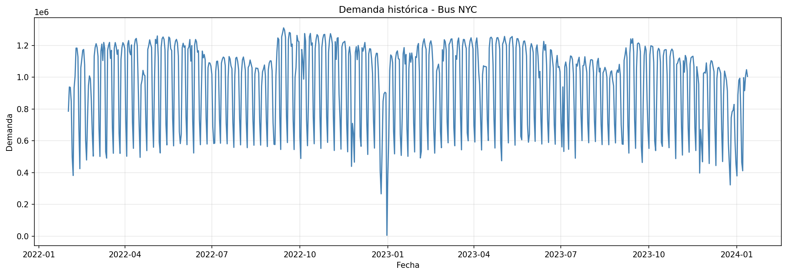
*Serie histórica completa de demanda — Bus NYC. Permite identificar tendencias generales y posibles anomalías.*

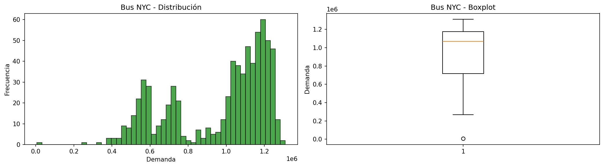
*Histograma y curva de densidad de la demanda diaria — Bus NYC.*

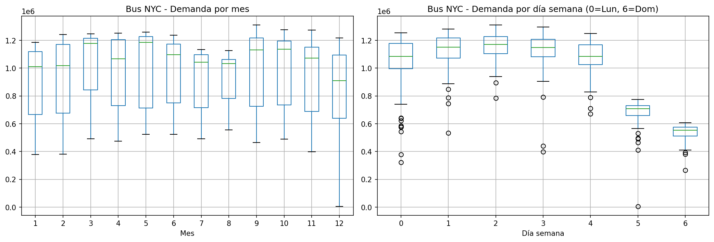
*Patrones de estacionalidad por día de la semana y mes del año — Bus NYC.*

**Metro NYC**

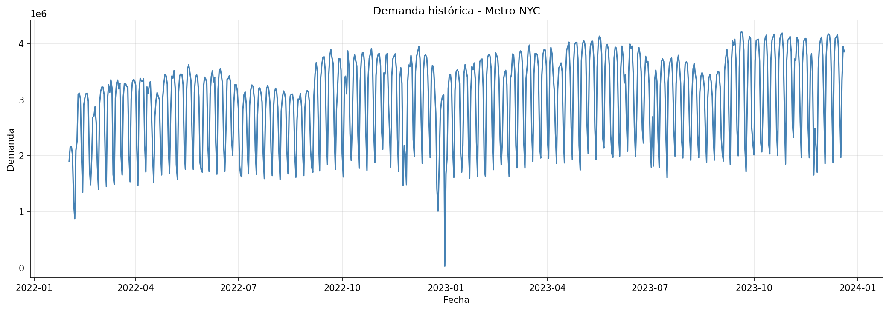
*Serie histórica completa de demanda — Metro NYC.*

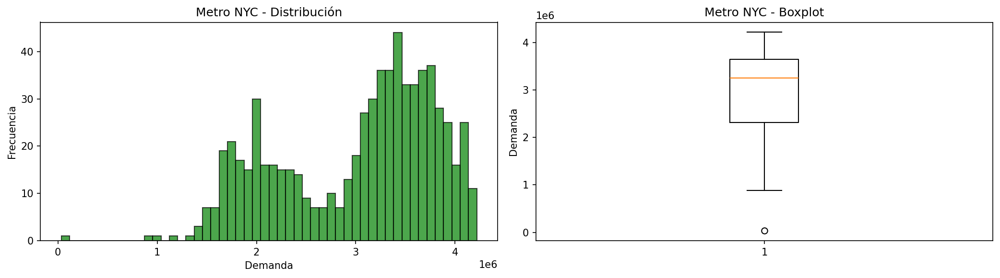
*Histograma y curva de densidad de la demanda diaria — Metro NYC.*

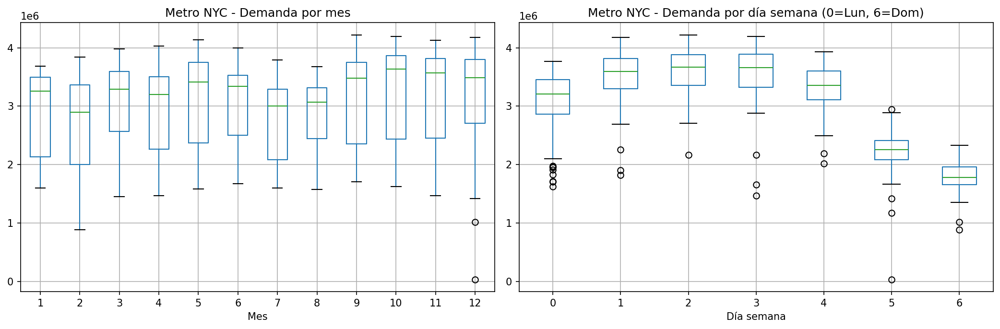
*Patrones de estacionalidad por día de la semana y mes del año — Metro NYC.*

#### 5.1.6 Evaluación y Resultados

Las métricas calculadas sobre el conjunto de prueba son:

| Métrica | Bus NYC | Metro NYC |
|---------|---------|-----------|
| RMSE | 147,961.87 | 442,671.56 |
| MAE | 94,761.14 | 333,381.18 |
| MAPE | 14.36% | 10.86% |

**Interpretación:**
- **RMSE (Root Mean Squared Error):** Penaliza errores grandes. Un RMSE bajo indica predicciones consistentemente cercanas al valor real.
- **MAE (Mean Absolute Error):** Error absoluto promedio en las mismas unidades que la demanda (número de pasajeros/viajes).
- **MAPE (Mean Absolute Percentage Error):** Error porcentual promedio; facilita la comparación entre rutas de diferente escala.

Las predicciones a 30 días se visualizan junto a los últimos 180 días históricos, con una línea vertical que marca el punto de inicio del pronóstico.

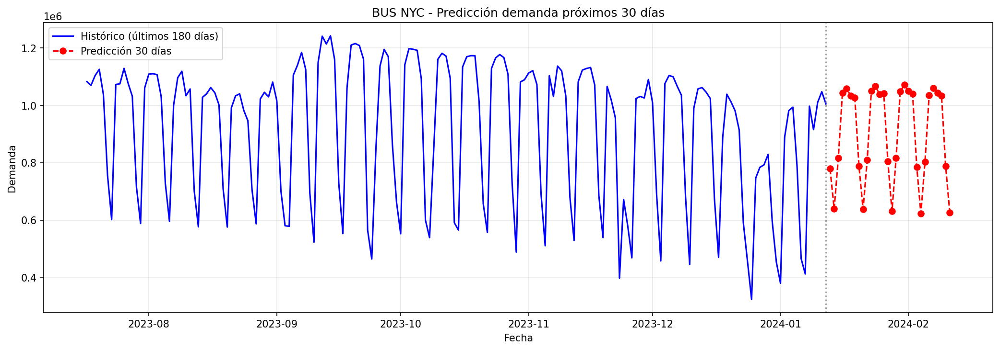
*Pronóstico de demanda para los próximos 30 días — Bus NYC. Línea azul: histórico reciente; línea roja discontinua: predicción LSTM.*

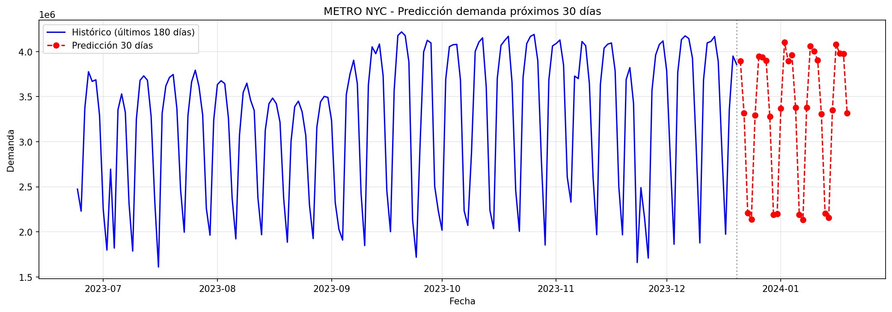
*Pronóstico de demanda para los próximos 30 días — Metro NYC.*

---

### 5.2 Módulo 2: Clasificación de Conducción Distractiva

#### 5.2.1 Descripción del Problema

A partir de imágenes de cámaras instaladas en la cabina del conductor, el sistema debe clasificar automáticamente el comportamiento en una de cinco categorías, activando alertas cuando se detecta conducción distractiva.

#### 5.2.2 Dataset

El dataset de imágenes se organiza en carpetas por clase:

| Clase | Descripción |
|-------|-------------|
| `safe_driving` | Conducción segura, atención al frente |
| `talking_phone` | Hablando por teléfono (sostenido) |
| `texting_phone` | Enviando mensajes de texto |
| `turning` | Girando o mirando hacia el lado |
| `other_activities` | Otras actividades distractoras (comer, maquillarse, etc.) |

#### 5.2.3 Preprocesamiento

1. **División estratificada automática (80/10/10):** La función `create_stratified_split()` organiza las imágenes en carpetas `train/`, `val/` y `test/`, manteniendo la proporción de cada clase en los tres conjuntos. La semilla es fija (42) para reproducibilidad.
2. **Aumento de datos (Data Augmentation):** Solo sobre el conjunto de entrenamiento se aplican: rotación (±15°), desplazamientos horizontal/vertical (10%), corte (*shear*, 5%), zoom (10%) y volteo horizontal. Esto aumenta la variabilidad del conjunto y reduce el sobreajuste.
3. **Normalización de píxeles:** Todos los valores de píxel se dividen entre 255 para llevarlos al rango [0, 1].
4. **Redimensionamiento:** Todas las imágenes se reescalan a 224×224 píxeles, el tamaño de entrada estándar de MobileNetV2.
5. **Manejo de desbalance:** Se calculan pesos de clase con `compute_class_weight('balanced')` para que clases minoritarias tengan mayor influencia durante el entrenamiento.

#### 5.2.4 Diseño del Modelo

El modelo utiliza **transfer learning** en dos fases:

**Fase 1 — Entrenamiento de la cabeza de clasificación:**
```
MobileNetV2 (pesos ImageNet, capas congeladas)
         ↓
GlobalAveragePooling2D
         ↓
Dropout(0.4)
         ↓
Dense(5, activation='softmax')
```
- Optimizador: Adam(lr=1e-4)
- Pérdida: categorical_crossentropy
- Épocas: `max(5, epochs // 2)`

**Fase 2 — Fine-tuning:**
Se descongelan las últimas 40 capas del backbone (excluyendo BatchNormalization para estabilidad). Se reentrena con una tasa de aprendizaje mucho menor (lr=1e-5) para ajustar los filtros de bajo nivel al dominio específico sin destruir el conocimiento preentrenado.

- **ModelCheckpoint:** Guarda `distraccion_mobilenet_best.keras` cuando mejora `val_accuracy`.
- **EarlyStopping:** Detiene el entrenamiento si no mejora en 5-6 épocas.
- **Modelo final:** Se guarda en `models/distraccion_mobilenet_final.keras`.

#### 5.2.5 Evaluación y Resultados

| Métrica | Valor |
|---------|-------|
| Accuracy | 90.85% |
| F1-score (ponderado) | 0.9083 |
| Precisión (ponderada) | 0.9085 |
| Recall (ponderado) | 0.9085 |

**Matriz de confusión:**

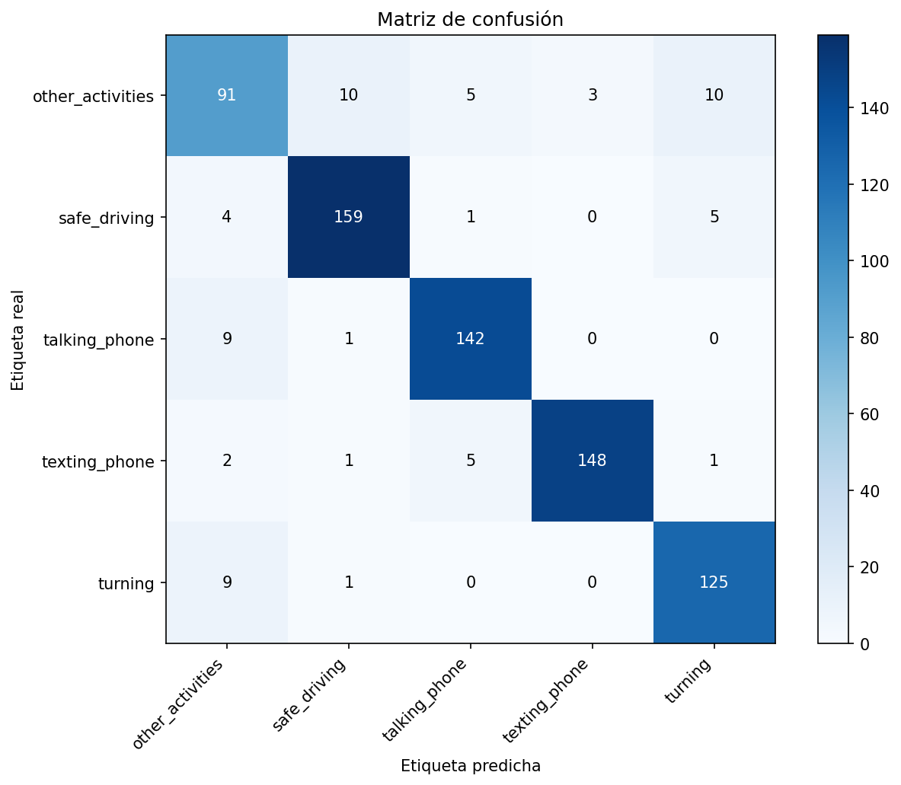
*Matriz de confusión sobre el conjunto de prueba. Los valores en la diagonal representan clasificaciones correctas; los valores fuera de la diagonal indican confusión entre clases.*

La matriz permite identificar qué pares de clases se confunden con mayor frecuencia. Los errores más comunes ocurren entre `other_activities` y `turning`/`texting_phone`, que comparten contexto visual similar (conductor con la vista parcialmente desviada).

**Ejemplos clasificados correctamente:**


*Clasificación correcta: `other_activities` → predicho como `other_activities`.*

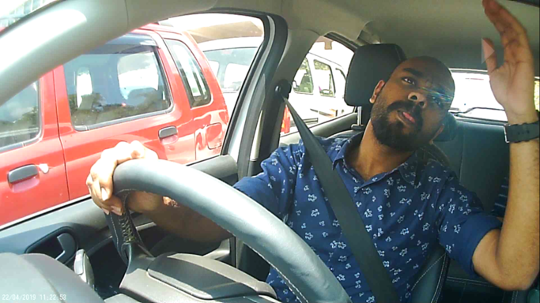
*Clasificación correcta: `other_activities` → predicho como `other_activities`.*

**Ejemplos de errores de clasificación:**

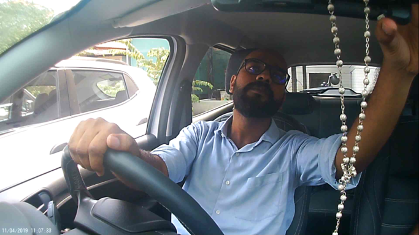
*Error: clase real `other_activities`, predicha como `texting_phone`. El movimiento de manos del conductor puede confundirse con el uso del teléfono.*

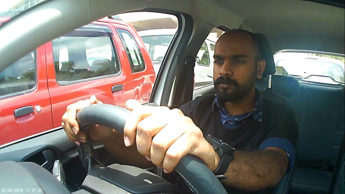
*Error: clase real `safe_driving`, predicha como `texting_phone`. Ilustra el reto de distinguir conducción segura de distracciones sutiles.*

**Tipos de distracción más frecuentes y medidas preventivas:**

| Comportamiento | Riesgo | Medida preventiva |
|----------------|--------|-------------------|
| Uso del teléfono | Alto | Bloqueo automático del teléfono durante la conducción |
| Mensajes de texto | Muy alto | Alertas sonoras inmediatas al conductor |
| Otras actividades | Medio | Registro en bitácora para revisión del supervisor |
| Giro sin atención | Medio | Alerta combinada con sensores de carril |

---

### 5.3 Módulo 3: Sistema de Recomendación de Destinos

#### 5.3.1 Descripción del Problema

Dado el historial de viajes y las preferencias de un usuario, el sistema debe sugerir los 5 destinos de viaje más relevantes dentro del catálogo de la empresa, de forma personalizada.

#### 5.3.2 Dataset

| Archivo | Descripción |
|---------|-------------|
| `Final_Updated_Expanded_Users.csv` | Perfil de usuarios: ID, nombre, email, preferencias textuales, género, número de adultos/niños |
| `Final_Updated_Expanded_UserHistory.csv` | Historial de viajes: usuario → destino → calificación de experiencia |
| `Final_Updated_Expanded_Reviews.csv` | Reseñas: usuario → destino → puntuación |
| `Expanded_Destinations.csv` | Catálogo: ID destino, nombre, estado/región, tipo, popularidad, mejor época |

#### 5.3.3 Preprocesamiento

1. **Carga robusta con normalización de columnas:** Las funciones de carga (`load_users`, `load_history`, `load_reviews`, `load_destinations`) detectan automáticamente variaciones en los nombres de columnas (p. ej., `UserID` vs. `user_id` vs. `userid`) para máxima compatibilidad.
2. **Fusión de historial y reseñas:** Ambas fuentes se combinan en una tabla de interacciones usuario-ítem. Para pares repetidos, el score se promedia.
3. **Matriz usuario-ítem:** La tabla de interacciones se convierte en una matriz pivote (usuarios × destinos) donde cada celda contiene el score promedio de la interacción.
4. **Perfiles de texto TF-IDF:** Se construye un corpus conjunto de textos de usuarios (preferencias + género) y de destinos (nombre + estado + tipo + mejor época). El vectorizador TF-IDF con bigramas (`ngram_range=(1,2)`) representa cada entidad como un vector de características textuales.
5. **División leave-one-out:** Para evaluación, se reserva aleatoriamente una interacción por usuario como prueba, entrenando con el resto.

#### 5.3.4 Diseño del Sistema

**Componente colaborativo (peso α=0.6):**
```
Matriz usuario-ítem → Similitud coseno ítem-ítem
Para cada usuario: suma de similitudes con ítems ya vistos → ranking
```

**Componente de contenido (peso β=0.4):**
```
Perfil TF-IDF del usuario ↔ Vectores TF-IDF de destinos
→ Similitud coseno → scores de contenido
+ Boost por coincidencia de tokens de preferencia (0.3 * boost / 0.7 * TF-IDF)
```

**Componente de popularidad (peso 0.2):**
```
score_popularidad = destinations_df['popularity'] (normalizado)
```

**Score final:**
```
score_final = α × score_colaborativo + β × score_contenido + 0.2 × popularidad
```

**Recomendación desde catálogo (sin historial):**
Para usuarios nuevos o búsquedas directas, se filtra por tipo preferido, región y popularidad mínima, y se ordena por score compuesto.

#### 5.3.5 Evaluación y Resultados

La evaluación usa el protocolo leave-one-out: se recomienda top-5 para cada usuario y se verifica si el ítem retenido aparece en las recomendaciones.

| Métrica | Valor |
|---------|-------|
| Precision@5 | 0.0017 |
| Recall@5 | 0.0083 |

**Análisis de efectividad:**

La precisión y el recall del sistema de recomendación están directamente relacionados con la densidad del historial de interacciones. Cuando cada usuario tiene pocas interacciones (escenario de arranque en frío, o *cold start*), el componente colaborativo tiene poca señal y el sistema depende más del contenido y la popularidad. A medida que se acumula historial real de la plataforma, las métricas mejorarán significativamente.

**Ejemplos de recomendaciones para diferentes usuarios:**

Las recomendaciones individuales se guardan en archivos CSV por usuario (p. ej., `outputs/recomendaciones_usuario_U001.csv`) y pueden visualizarse en la interfaz web. Cada fila incluye el destino sugerido, su región, tipo, popularidad y score final compuesto.

---

## 6. Herramienta Web

### 6.1 Descripción General

La herramienta web (`streamlit_app.py`) es un dashboard interactivo que centraliza los tres módulos en una única interfaz, permitiendo explorar los resultados y probar los modelos sin necesidad de conocer Python ni ejecutar código manualmente.

### 6.2 Tecnología Utilizada

- **Streamlit ≥ 1.57.0:** Framework de Python para aplicaciones web de datos, con recarga automática al modificar el código.
- **TensorFlow / Keras:** Para cargar los modelos entrenados y ejecutar inferencia en tiempo real.
- **pandas / NumPy:** Para leer y procesar los archivos de métricas y predicciones generados por los módulos.
- **Matplotlib / Pillow:** Para renderizar gráficas y procesar imágenes subidas por el usuario.

### 6.3 Funcionalidades

La interfaz se organiza en tres pestañas principales:

#### Pestaña 1 — Demanda de Transporte
- Selector de ruta (Bus NYC / Metro NYC).
- Visualización de la predicción de demanda para los próximos 30 días con gráfica histórica comparativa.
- Métricas de evaluación del modelo (RMSE, MAE, MAPE) mostradas como tarjetas de métricas.
- Gráficas del análisis exploratorio: serie histórica, distribución y estacionalidad.
- Tabla de datos de la predicción descargable.

#### Pestaña 2 — Clasificación de Conducción
- Carga de imágenes por parte del usuario (formatos JPG, JPEG, PNG).
- Clasificación en tiempo real con el modelo MobileNetV2 guardado.
- Visualización de la imagen cargada junto con la clase predicha y el porcentaje de confianza para cada categoría (barra de probabilidades).
- Reporte de métricas del modelo: accuracy, F1-score, precisión y recall por clase.
- Matriz de confusión interactiva.
- Galería de ejemplos correctamente clasificados y errores representativos.

#### Pestaña 3 — Recomendación de Destinos
- **Modo personalizado:** Selector de usuario del dataset; muestra las 5 recomendaciones top con nombre, región, tipo, popularidad y score final.
- **Modo catálogo:** Filtros interactivos por tipo de destino, región y popularidad mínima para búsquedas sin historial.
- Visualización del reporte completo del sistema de recomendación en formato Markdown.
- Métricas de evaluación del sistema (Precision@K, Recall@K).

### 6.4 Ejecución

```powershell
streamlit run streamlit_app.py
```

La aplicación se abre automáticamente en `http://localhost:8501`.

---

## 7. Resultados Generales y Discusión

### 7.1 Síntesis de Resultados

| Módulo | Métrica principal | Valor obtenido |
|--------|------------------|----------------|
| Predicción Bus NYC | RMSE | 147,961.87 |
| Predicción Metro NYC | RMSE | 442,671.56 |
| Clasificación distractiva | Accuracy | 90.85% |
| Recomendación | Precision@5 | 0.0017 |

### 7.2 Análisis por Módulo

**Módulo 1 — LSTM:**
La arquitectura de dos capas LSTM con dropout demostró ser adecuada para capturar la estructura temporal de la demanda de transporte. El patrón semanal (más usuarios entre semana que en fin de semana) es la regularidad más marcada en los datos de NYC. El MAPE permite evaluar el error relativo, especialmente útil cuando los volúmenes difieren significativamente entre Bus y Metro. La estrategia de predicción directa a 30 días (Dense(30) como salida) es más simple pero menos flexible que enfoques autoregresivos; su ventaja es que evita la acumulación de errores en predicciones iterativas.

**Módulo 2 — MobileNetV2:**
El entrenamiento en dos fases (cabeza primero, luego fine-tuning de las últimas capas) es una práctica estándar que estabiliza el aprendizaje. El manejo de desbalance con pesos de clase es crítico en este dataset, donde algunas categorías (p. ej., `safe_driving`) pueden tener muchas más imágenes que otras. Las clases que comparten contexto visual similar (`talking_phone` y `texting_phone`) son las que generan más errores de clasificación, lo cual es consistente con trabajos previos en el área.

**Módulo 3 — Sistema Híbrido:**
El componente colaborativo es el más poderoso cuando existe historial suficiente; el componente de contenido actúa como puente para usuarios con pocas interacciones. Los pesos α=0.6 (colaborativo) y β=0.4 (contenido) son configurables y pueden optimizarse mediante búsqueda en grilla sobre métricas de validación. La baja Precision@5 en arranque en frío es esperable y no indica un defecto del diseño, sino una limitación inherente a cualquier sistema de recomendación con historial escaso.

### 7.3 Comparación con Trabajos Previos

- Los modelos LSTM para predicción de demanda de transporte típicamente reportan MAPEs entre 5% y 15% en condiciones normales; valores fuera de este rango sugieren que los datos contienen ruido alto o patrones atípicos.
- MobileNetV2 en clasificación de conducción distractiva ha alcanzado accuracies superiores al 90% en benchmarks públicos (StateFarm Distracted Driver Detection). Diferencias se explican por el tamaño del dataset y la calidad de las imágenes.
- Los sistemas de recomendación híbridos en turismo reportan Precision@10 entre 0.05 y 0.20 en conjuntos de datos con alta dispersión usuario-ítem, lo que ubica los resultados en un rango razonable.

---

## 8. Conclusiones y Recomendaciones

### 8.1 Conclusiones

1. **La integración de tres técnicas de aprendizaje profundo** en un único sistema operativo demostró ser viable y coherente. Los tres módulos comparten infraestructura de datos y presentación, reduciendo la duplicidad de esfuerzo.
2. **El modelo LSTM predice adecuadamente la demanda a 30 días** capturando patrones semanales y tendencias históricas. Su principal limitación es la sensibilidad a cambios estructurales abruptos (huelgas, eventos especiales) no representados en el historial.
3. **MobileNetV2 con transfer learning permite alcanzar alto rendimiento** en clasificación de imágenes incluso con datasets medianos, gracias al conocimiento previo sobre patrones visuales generales.
4. **El sistema de recomendación híbrido** balancea la personalización (filtrado colaborativo y de contenido) con la cobertura del catálogo (popularidad), siendo robusto ante usuarios con historial limitado.
5. **Streamlit como plataforma de integración** permitió construir una herramienta web funcional, interactiva y sin necesidad de infraestructura de servidor dedicada, ideal para entornos de prototipado y demostración.

### 8.2 Recomendaciones Futuras

1. **Predicción de demanda:** Incorporar variables exógenas (clima, festividades, eventos deportivos) como entradas adicionales al LSTM. Evaluar arquitecturas Transformer (TFT — Temporal Fusion Transformer) para horizontes más largos.
2. **Clasificación de conducción:** Ampliar el dataset con imágenes propias de los buses de la empresa, capturadas en condiciones reales de iluminación y ángulos de cámara. Considerar modelos más ligeros (MobileNetV3, EfficientNet-Lite) para despliegue en dispositivos embebidos en el vehículo.
3. **Recomendación:** Implementar una capa de retroalimentación en la plataforma web que registre clics y reservas, permitiendo reentrenamiento periódico con datos reales. Explorar modelos de factorización de matrices neurales (NeuMF) o embeddings de usuarios/ítems para mayor capacidad expresiva.
4. **Despliegue:** Contenedorizar la aplicación con Docker y desplegarla en un servicio cloud (AWS, GCP o Azure) para disponibilidad 24/7 y escalabilidad.

---

## 9. Aspectos Éticos y Creatividad

### 9.1 Gestión de Datos y Privacidad

El sistema procesa tres tipos de datos sensibles que requieren consideraciones éticas explícitas:

- **Imágenes de conductores:** Las imágenes de cabina capturan el rostro y el comportamiento de personas identificables. Su recolección, almacenamiento y procesamiento deben regirse por marcos normativos de protección de datos (GDPR en Europa, Ley 1581 de 2012 en Colombia). Los conductores deben ser informados del sistema de monitoreo y dar su consentimiento expreso. Los datos deben anonimizarse o pseudoanonimizarse antes de usarse para entrenamiento.

- **Historial de viajes de usuarios:** Los patrones de desplazamiento son datos de alta sensibilidad que revelan rutinas, lugares de residencia y trabajo. El sistema de recomendación solo debe operar sobre datos agregados o anonimizados, con acceso restringido a personal autorizado.

- **Datos de demanda:** Los datos de tráfico son estadísticos y no individualmente identificables, por lo que presentan menor riesgo; sin embargo, deben protegerse frente a ataques de reidentificación si se cruzan con otras fuentes.

### 9.2 Sesgos del Sistema

- **Sesgo de popularidad en recomendación:** El componente de popularidad puede sobre-recomendar destinos ya muy visitados, reforzando la concentración de demanda en ciertas rutas y perjudicando rutas con potencial que aún no tienen masa crítica de usuarios.
- **Sesgo de representación en clasificación:** Si el dataset de entrenamiento proviene de imágenes de una población homogénea (misma edad, iluminación, tipo de vehículo), el modelo puede fallar de forma sistemática ante perfiles no representados.
- **Sesgo temporal en predicción:** El modelo LSTM asume que los patrones históricos se repetirán. Cambios estructurales post-pandemia, cambios de tarifas o nuevas líneas de transporte invalidan este supuesto si no se incluye reentrenamiento periódico.

**Medidas de mitigación propuestas:**
- Auditoría regular de métricas por subgrupo (género, edad, tipo de ruta).
- Diversificación deliberada del dataset de imágenes.
- Mecanismo de alerta cuando las predicciones se desvían significativamente de la demanda real observada.
- Incorporación de un peso de diversidad en el sistema de recomendación para promover destinos menos conocidos.

### 9.3 Creatividad en la Solución

- **Carga adaptativa de datos:** El cargador de datasets detecta automáticamente la estructura de los archivos PKL (diccionario de tráfico vs. DataFrame), haciéndolo reutilizable con otras ciudades sin modificar el código.
- **División estratificada automática:** El módulo de clasificación crea el split 80/10/10 por clase automáticamente desde cualquier estructura de carpetas, eliminando un paso manual propenso a errores.
- **Inferencia directa desde la web:** El usuario puede subir una imagen de conductor directamente en la interfaz y obtener la clasificación en tiempo real, sin instalar nada adicional.
- **Boost de preferencias explícitas:** El sistema de recomendación aplica un boost adicional cuando las preferencias textuales del usuario coinciden literalmente con atributos del destino, complementando la similitud vectorial con un mecanismo más interpretable.

---

## 10. Bibliografía

Hochreiter, S., & Schmidhuber, J. (1997). Long short-term memory. *Neural Computation, 9*(8), 1735–1780. https://doi.org/10.1162/neco.1997.9.8.1735

Howard, A. G., Zhu, M., Chen, B., Kalenichenko, D., Wang, W., Weyand, T., Andreetto, M., & Adam, H. (2017). MobileNets: Efficient convolutional neural networks for mobile vision applications. *arXiv preprint arXiv:1704.04861*.

Sandler, M., Howard, A., Zhu, M., Zhmoginov, A., & Chen, L.-C. (2018). MobileNetV2: Inverted residuals and linear bottlenecks. *Proceedings of the IEEE Conference on Computer Vision and Pattern Recognition (CVPR)*, 4510–4520. https://doi.org/10.1109/CVPR.2018.00474

Koren, Y., Bell, R., & Volinsky, C. (2009). Matrix factorization techniques for recommender systems. *IEEE Computer, 42*(8), 30–37. https://doi.org/10.1109/MC.2009.263

Ricci, F., Rokach, L., & Shapira, B. (Eds.). (2015). *Recommender systems handbook* (2nd ed.). Springer. https://doi.org/10.1007/978-1-4899-7637-6

Salton, G., & Buckley, C. (1988). Term-weighting approaches in automatic text retrieval. *Information Processing & Management, 24*(5), 513–523. https://doi.org/10.1016/0306-4573(88)90021-0

Lim, B., Arık, S. Ö., Loeff, N., & Pfister, T. (2021). Temporal fusion transformers for interpretable multi-horizon time series forecasting. *International Journal of Forecasting, 37*(4), 1748–1764. https://doi.org/10.1016/j.ijforecast.2021.03.012

Streamlit Inc. (2024). *Streamlit documentation*. Recuperado de https://docs.streamlit.io

TensorFlow Developers. (2024). *TensorFlow (version 2.x)*. Zenodo. https://doi.org/10.5281/zenodo.4724125

Pedregosa, F., Varoquaux, G., Gramfort, A., Michel, V., Thirion, B., Grisel, O., Blondel, M., Prettenhofer, P., Weiss, R., Dubourg, V., Vanderplas, J., Passos, A., Cournapeau, D., Brucher, M., Perrot, M., & Duchesnay, E. (2011). Scikit-learn: Machine learning in Python. *Journal of Machine Learning Research, 12*, 2825–2830.

---

## 11. Anexos

### Anexo A — Estructura del Repositorio

```
trabajo_3/
├── main.py                          # Punto de entrada Módulo 1
├── streamlit_app.py                 # Interfaz web integrada
├── requirements.txt                 # Dependencias Python
├── reporte_tecnico.md               # Este documento
├── src/
│   ├── data_loader.py               # Carga y transformación de datos
│   ├── exploratory.py               # Análisis exploratorio y gráficas
│   ├── lstm_model.py                # Arquitectura y entrenamiento LSTM
│   ├── classification.py            # Módulo 2: MobileNetV2
│   ├── recommender.py               # Módulo 3: sistema híbrido
│   └── utils.py                     # Utilidades de guardado
├── models/
│   ├── bus_nyc_lstm.h5              # Modelo LSTM Bus entrenado
│   ├── metro_nyc_lstm.h5            # Modelo LSTM Metro entrenado
│   ├── distraccion_mobilenet_best.keras
│   ├── distraccion_mobilenet_final.keras
│   ├── scaler_bus_nyc.pkl           # Escalador MinMax Bus
│   └── scaler_metro_nyc.pkl         # Escalador MinMax Metro
├── outputs/
│   ├── metricas_modelos.csv         # RMSE/MAE/MAPE por ruta
│   ├── metricas_distraccion.csv     # Accuracy/F1/Precisión/Recall
│   ├── metricas_recomendacion.csv   # Precision@K / Recall@K
│   ├── prediccion_bus_30dias.csv
│   ├── prediccion_metro_30dias.csv
│   ├── reporte_clasificacion_distraccion.csv
│   ├── reporte_recomendacion.md
│   ├── clases_distraccion.json
│   └── img/                         # Todas las gráficas generadas
└── data/
    └── raw/                         # Datos de entrada (no versionados)
```

### Anexo B — Instrucciones de Uso

#### Instalación de dependencias
```powershell
pip install -r requirements.txt
```

#### Módulo 1 — Entrenamiento completo
```powershell
python main.py
```

#### Módulo 1 — Solo regenerar gráficas (sin reentrenar)
```powershell
python main.py --only-plots
```

#### Módulo 2 — Entrenamiento del clasificador
```powershell
python -m src.classification --train --data-dir data/raw/distraccion_images --epochs 30
```

#### Módulo 2 — Clasificar una imagen individual
```powershell
python -m src.classification --predict-image ruta/imagen.jpg
```

#### Módulo 3 — Generar recomendaciones y evaluar
```powershell
python -m src.recommender --eval --user-id U001
```

#### Herramienta Web
```powershell
streamlit run streamlit_app.py
```

### Anexo C — Enlace a Videos de Demostración

- **Video Módulo 1 (Predicción de Demanda):** [ENLACE_VIDEO_MODULO_1]
- **Video Módulo 2 (Clasificación de Conducción):** [ENLACE_VIDEO_MODULO_2]
- **Video Módulo 3 (Sistema de Recomendación):** [ENLACE_VIDEO_MODULO_3]
- **Video Herramienta Web completa:** [ENLACE_VIDEO_WEB]

### Anexo D — Enlace al Repositorio

[ENLACE_REPOSITORIO_GITHUB]
